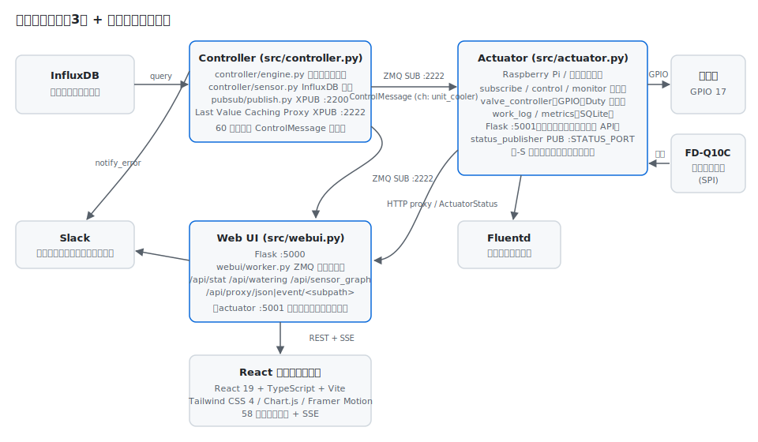
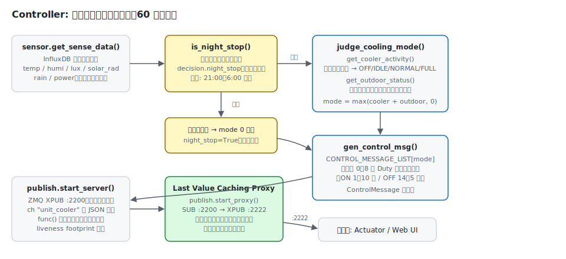
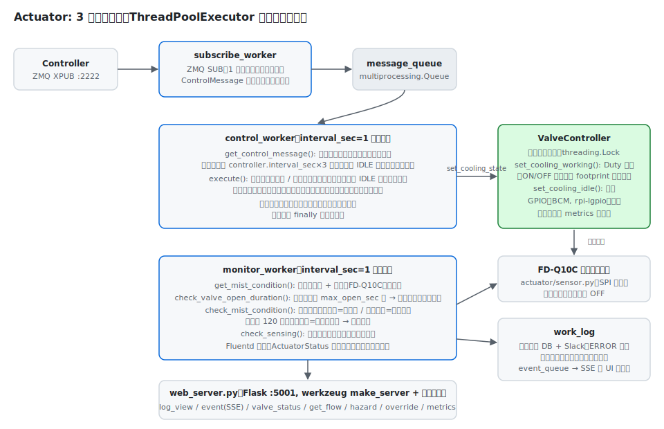
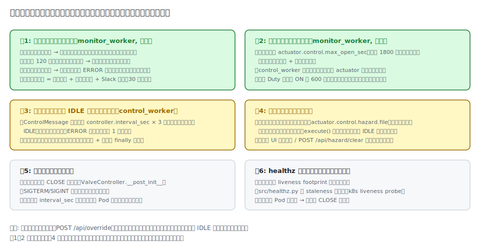
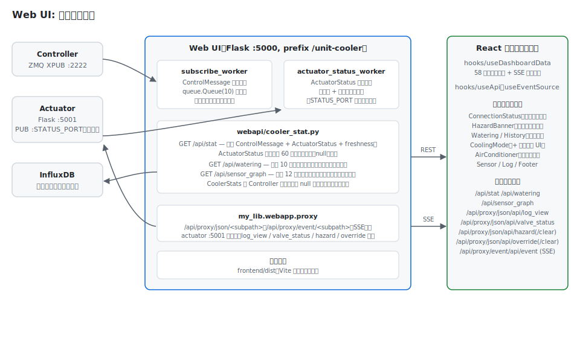
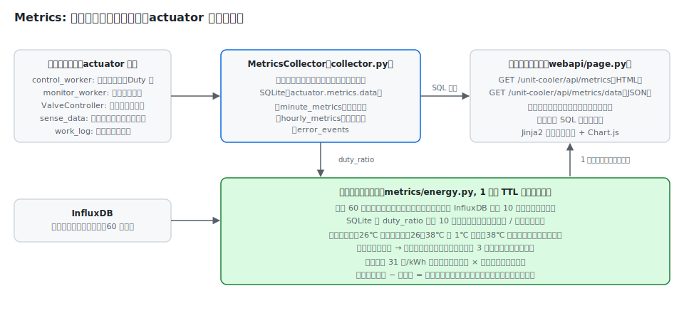

# アーキテクチャ

エアコン室外機自動冷却システム（unit-cooler）のコード構造と動作原理をまとめたドキュメントです。
記載内容はすべて本リポジトリの実装（`src/`, `frontend/`, `kubernetes/` 等）に基づきます。

## 目次

- [全体像](#全体像)
- [プロセス間通信](#プロセス間通信)
- [Controller](#controller)
- [Actuator](#actuator)
- [フェイルセーフ設計](#フェイルセーフ設計)
- [Web UI](#web-ui)
- [Metrics](#metrics)
- [設定](#設定)
- [ヘルスチェックとデプロイ](#ヘルスチェックとデプロイ)
- [テスト構成](#テスト構成)

## 全体像

システムは 3 つの独立した Python プロセス（Controller / Actuator / Web UI）と、
Web UI が配信する React フロントエンドで構成されます。



| コンポーネント | エントリポイント | 役割 | 主なポート |
| --- | --- | --- | --- |
| Controller | `src/controller.py` | InfluxDB の電力・環境データから冷却モードを判定し、ZeroMQ で配信 | XPUB 2200（実サーバー）/ 2222（LVC Proxy） |
| Actuator | `src/actuator.py` | 制御メッセージを購読し、GPIO で電磁弁を Duty 制御。流量監視と安全制御 | Flask 5001、PUB `-S`（既定は無効） |
| Web UI | `src/webui.py` | 制御メッセージ・Actuator 状態を集約する REST API と React UI の配信 | Flask 5000 |

ソースは `src/unit_cooler/` 配下にコンポーネント別のパッケージ
（`controller/`, `actuator/`, `webui/`, `pubsub/`, `metrics/`）として配置されています
（ディレクトリ全体の一覧は [CLAUDE.md](../CLAUDE.md) を参照）。

## プロセス間通信

### ZeroMQ Pub/Sub と Last Value Caching Proxy

制御メッセージは ZeroMQ の Pub/Sub（チャンネル `unit_cooler`、`const.PUBSUB_CH`）で配信されます。
実装は `src/unit_cooler/pubsub/publish.py` / `subscribe.py` です。

- `publish.start_server()` — XPUB ソケットをポート 2200（`-r REAL_PORT`）に bind し、
  60 秒（`controller.interval_sec`）周期で `ControlMessage` の JSON を配信する。
  メッセージ生成の一過性例外ではループを止めない。
- `publish.start_proxy()` — Last Value Caching Proxy
  （[ZeroMQ Guide Chapter 5](https://zguide.zeromq.org/docs/chapter5/) のパターン）。
  2200 を購読して 2222（`-p SERVER_PORT`）に XPUB で再配信し、**最新メッセージをキャッシュして
  新規購読者へ即時再送**する。これにより購読側は接続直後から最大 60 秒待たずに現在の制御状態を得られる。
  イベント処理単位で例外を捕捉して継続する。
- `subscribe.start_client()` — 1 秒タイムアウト付きの SUB ループ。不正メッセージはスキップし、
  終了イベント（`threading.Event`）で停止できる。

ポート番号は config ではなく各エントリポイントのコマンドライン引数
（`-p` / `-r` / `-l` / `-S`）と環境変数（`HEMS_CONTROL_HOST`, `HEMS_PUB_PORT` 等、
`config.py` の `_ENV_OVERRIDES`）で指定します。

### メッセージスキーマ（`src/unit_cooler/messages.py`）

すべて frozen dataclass で、`to_dict()` / `from_dict()` によるシリアライズ境界を持ちます。

- **`ControlMessage`** — Controller → Actuator / Web UI。
  `state`（`COOLING_STATE.WORKING/IDLE`）、`duty`（`DutyConfig`: enable / on_sec / off_sec）、
  `mode_index`（0〜8）、`sense_data`、`cooler_status` / `outdoor_status`（`StatusInfo`）、
  `night_stop`（夜間停止によるモード 0 固定か）。
- **`ActuatorStatus`** — Actuator → Web UI（`-S STATUS_PORT` 指定時のみ、トピック `actuator_status`）。
  `timestamp`、`valve`（`ValveStatus`: state / duration_sec）、`flow_lpm`、
  `cooling_mode_index`、`hazard_detected`。
- **`SenseData` / `SensorReading`** — 制御判断に使うセンサーデータ一式。
  有効性チェック対象のフィールド名は `environment_field_names()` で dataclass 定義から導出され、
  センサー追加時のチェック漏れを構造的に防ぐ。

## Controller

`src/unit_cooler/controller/` — InfluxDB のデータから冷却モード（0〜8）を判定します。



1. **データ取得**（`sensor.py`）: `get_sense_data()` が temp / humi / lux / solar_rad / rain /
   power（エアコン各台）を InfluxDB から並列取得する。取得対象は
   `controller.sensor` 設定の測定点リストで、種別は `SensorConfig` の dataclass フィールドから導出。
2. **夜間停止判定**（`engine.is_night_stop()`）: `controller.decision.night_stop`
   （既定: 21:00〜6:00、分単位指定可、`start == end` は「停止しない」）の時間帯なら
   モード 0 に固定し、`night_stop=True` を配信する。夜間停止中はセンサーデータ欠損の
   Slack 通知を抑制する（ログのみ）。
3. **冷却モード判定**（`engine.judge_cooling_mode()`）:
   - `sensor.get_cooler_activity()` — 各エアコンの消費電力と外気温から稼働状態
     （`AIRCON_MODE`: OFF / IDLE / NORMAL / FULL）を判定し、稼働台数からベースの強度を決める。
   - `sensor.get_outdoor_status()` — 外気温・日射量・湿度・降雨量の閾値
     （`controller.decision.thresholds`）で強度を補正する（湿度・降雨の上限超過で停止側に振れる）。
   - `cooling_mode = max(cooler_status + outdoor_status, 0)`
4. **メッセージ生成**（`engine.gen_control_msg()`）: `controller/message.py` の
   `CONTROL_MESSAGE_LIST`（モード 0 = IDLE、モード 1〜8 = WORKING で
   ON 1〜10 分 / OFF 14〜5 分の Duty テンプレート）から `ControlMessage` を構築する。

配信スレッド（`start_server`）と LVC Proxy スレッドは `src/controller.py` が daemon スレッドとして起動します。

## Actuator

`src/unit_cooler/actuator/` — Raspberry Pi 上で電磁弁と流量センサーを制御します。
`ThreadPoolExecutor` 上で 3 つのワーカが動きます（`worker.py`）。



- **subscribe_worker** — `pubsub/subscribe.py` の共通実装で ControlMessage を購読し、
  `multiprocessing.Queue` に積む。
- **control_worker**（1 秒周期） — キューをドレインして最新メッセージを採用し、
  `control.execute()` → `ValveController.set_cooling_state()` でバルブを制御する。
  - 受信途絶が `controller.interval_sec × 3` を超えたら IDLE にフォールバック。
  - `execute()` はハザードラッチ / 手動オーバーライドが有効な場合に IDLE へ差し替えた
    「実効メッセージ」を返し、worker はそれを `set_last_control_message()` に保存する
    （Fluentd・ActuatorStatus にも実効値が反映される）。
  - ループはイテレーション単位で例外を捕捉して継続し、脱出時は finally で必ず閉弁する。
- **monitor_worker**（1 秒周期） — `monitor.get_mist_condition()` でバルブ状態と流量を取得し、
  異常検知（後述）、Fluentd への状態送信、ActuatorStatus の配信、流量メトリクスの記録を行う。

### ValveController（`valve_controller.py`）

シングルトン（`init_valve_controller()` / `get_valve_controller()`）で、`threading.Lock` により
排他制御します。Duty 制御は「バルブ状態が変化した時刻」を `/dev/shm` 配下の footprint ファイルで
記録し、経過秒数と `duty.on_sec` / `duty.off_sec` を比較して開閉を切り替えます。
GPIO は BCM 番号（`actuator.control.valve.pin_no`）で rpi-lgpio を通じて制御します。

### 流量センサー（`sensor.py`）

KEYENCE FD-Q10C を SPI 経由で読み取ります（`my_lib.sensor.fd_q10c`）。
長時間閉弁が続き流量が 0 になるとセンサーの電源を切り、開弁で再開します。
無応答が続く場合は `monitor.check_sensing()` が周期的にリセットを試みます。

### ハザードラッチと手動オーバーライド（`control.py` / `override.py`）

- **ハザードラッチ** — 水漏れ・電磁弁故障などの検知は `actuator.control.hazard.file`
  （base_dir 相対パスは解決される。永続領域に置く想定）に footprint として記録され、
  存在する限り `execute()` が制御を IDLE に固定する。通知は同一メッセージ 30 分抑制。
  解除は `POST /api/hazard/clear`（または UI のバナー）で行う。
- **手動オーバーライド** — `POST /api/override`（JSON `{"duration_min": N}`、1〜1440 分）で
  指定時間だけ強制 IDLE にする。状態はラッチと同じディレクトリの
  `unit_cooler.override.json` に永続化され、失効すると自動で通常運転に戻る。

### 作動ログ（`work_log.py`）

`my_lib.webapp.log` のログ DB への記録、ERROR レベル時の Slack 通知、SSE 用イベントキューへの
通知を一括して行います。毎秒発火し得るエラー向けに「同一メッセージの抑制間隔」
（`suppress_interval_min` / `suppress_key`）を備えます。

### Web API（Flask :5001, prefix `/unit-cooler`）

`web_server.py` が werkzeug の `make_server` + スレッドで起動し、以下の blueprint を登録します:
`my_lib.webapp` の log_view / event(SSE) / util、`webapi/valve_status.py`（`GET /api/valve_status`）、
`webapi/flow_status.py`（`GET /api/get_flow`）、`webapi/hazard.py`
（`GET /api/hazard`, `POST /api/hazard/clear`）、`webapi/override.py`
（`GET|POST /api/override`, `POST /api/override/clear`）、`metrics/webapi/page.py`（ダッシュボード）。

## フェイルセーフ設計

電磁弁（= 水道）を制御するシステムとして、「バルブが開いたまま制御が失われる」事態を
多層防御で防ぎます。



| 層 | 実装 | 発動条件 |
| --- | --- | --- |
| 流量ハザード検知 | `monitor.check_mist_condition()` | 開弁中の過大流量（経過秒に応じた段階閾値 `monitor.flow.on.max`）、閉弁後 120 秒超の残流量（`flow.off.max` 超過） |
| 最大連続開弁タイマー | `monitor.check_valve_open_duration()` | 連続開弁が `actuator.control.max_open_sec`（既定 1800 秒）を超過。control_worker が停止していても monitor 経路で発動 |
| 途絶フォールバック | `control.get_control_message()` | ControlMessage の受信途絶が `controller.interval_sec × 3` を超過で IDLE |
| ハザードラッチ | `control.hazard_check()` | ラッチファイルが存在する限り強制 IDLE。永続領域に置くことで再起動を跨いで維持 |
| プロセスレベル | `ValveController.__post_init__` / シグナルハンドラ | 起動時 CLOSE 初期化、SIGTERM/SIGINT での閉弁、起動前の旧 Pod 待機（二重制御防止） |
| 外部監視 | `src/healthz.py` | 各ワーカの liveness footprint の staleness を k8s liveness probe で検査し、異常時は Pod 再起動 |

## Web UI

`src/unit_cooler/webui/` + `frontend/` — 状態の集約 API と React ダッシュボード。



### バックエンド（Flask :5000, prefix `/unit-cooler`）

- `webui/worker.py` の **subscribe_worker** が ControlMessage を購読して
  `queue.Queue(10)` に積む（満杯時は最古を破棄）。**actuator_status_worker** は
  `-S STATUS_PORT` 指定時に ActuatorStatus を購読し、最新値と受信時刻を保持する。
- `webui/webapi/cooler_stat.py`:
  - `GET /api/stat` — `CoolerStats`（sensor / mode / cooler_status / outdoor_status /
    actuator_status / freshness）。Controller 停止時も非 null のデフォルト値を返し、
    フロントエンドは null 分岐なしの単一型で扱える。ActuatorStatus は受信後 60 秒
    （`ACTUATOR_STATUS_STALE_SEC`）で鮮度切れとして null になる。
    `freshness` は Controller / Actuator それぞれの最終受信からの経過秒。
  - `GET /api/watering` — 直近 10 日分の散水量と水道代（InfluxDB へ並列クエリ、
    `watering.unit_price` で換算）。
  - `GET /api/sensor_graph` — 過去 12 時間のセンサー系列（10 分間引き）と
    エアコン別電力履歴（背景スパークライン・頻度ヒートバー用）。
- `my_lib.webapp.proxy` が `/api/proxy/json/<subpath>`・`/api/proxy/event/<subpath>`（SSE）を
  actuator :5001 へ転送する。フロントエンドからの actuator API 呼び出し
  （log_view / valve_status / get_flow / hazard / override）はすべてこのプロキシ経由。

### フロントエンド（`frontend/`）

React 19 + TypeScript + Vite + Tailwind CSS 4。ビルド成果物（`frontend/dist`）を
Web UI が静的配信します。

- **データ取得**: `hooks/useApi`（58 秒ポーリング、「一度も成功していない」間のみ loading）、
  `hooks/useEventSource`（SSE、接続状態を返す）、`hooks/useDashboardData`（集約）。
  API パスは `lib/api.ts` の `API_ENDPOINT` に一元化。
- **主要コンポーネント**: `ConnectionStatus`（freshness / SSE 状態から接続・鮮度を表示、
  Controller 途絶時はカードを淡色化）、`HazardBanner`（`hazard_detected` 時の警告と解除ボタン）、
  `Watering` / `History`（散水量・水道代）、`CoolingMode`（冷却モード・Duty カウントダウン・
  夜間停止バッジ・手動停止 UI `OverrideControl`）、`AirConditioner`（エアコン別電力バー）、
  `Sensor`、`Log`。カード単位の `ErrorBoundary` で部分障害を隔離。
- 型定義は `lib/ApiResponse.ts` にあり、バックエンドのレスポンス形状と対応する
  （整合性は `tests/integration/test_api_schema.py` で検証）。

## Metrics

`src/unit_cooler/metrics/` — actuator プロセス内で動く収集・可視化機構。



- **`collector.py`** — DB パス毎のシングルトン `MetricsCollector`。分単位バッファに
  冷却モード・Duty 比・流量・環境データ・バルブ操作回数を蓄積し、分境界で SQLite
  （`minute_metrics` / `hourly_metrics` / `error_events`、`schema/sqlite.schema`）へ保存する。
- **`webapi/page.py`** — ダッシュボード（`GET /api/metrics`）。統計・箱ひげ図・時系列・
  相関散布図のデータを SQL 側で集計して Jinja2 テンプレート + Chart.js で描画する。
- **`energy.py`** — 省エネ効果の推定。過去 60 日の全エアコン合算電力と外気温を InfluxDB から
  10 分粒度で取得し、SQLite の `duty_ratio` で「散水あり / なし」に分類。外気温 1℃ 刻みの
  ビン（26℃ 未満は除外）ごとに平均電力を比較して削減電力量を推定し、電気単価 31 円/kWh と
  水道代から「純益 = 削減電気代 − 水道代」を算出する（1 時間 TTL キャッシュ）。

## 設定

- **`config.yaml`**（スキーマ: `schema/config.schema`、サンプル: `config.example.yaml`） —
  `src/unit_cooler/config.py` が JSON Schema 検証後、dacite で **frozen dataclass**
  （`Config` → `ControllerConfig` / `ActuatorConfig` / `WebUIConfig` / slack）へ変換する。
  ファイルパス系は `pathlib.Path` 型で、`actuator.metrics.data` と
  `actuator.control.hazard.file` の相対パスは `base_dir` 基準で解決される。
- **`RuntimeSettings`** — ポートやダミーモードなど起動時パラメータ。docopt の引数と
  環境変数（`HEMS_*`, `DUMMY_MODE`）から生成され、環境変数が優先される。
- **環境変数** — `TEST`（テストモード）、`DUMMY_MODE`（ハードウェアなし動作）、
  `PYTEST_XDIST_WORKER`（並列テストのワーカー識別。バルブ状態ファイル等の
  ワーカー別パス化に使用）。

## ヘルスチェックとデプロイ

- **healthz**（`src/healthz.py`） — `-m CTRL|ACT|WEB` でコンポーネントを指定し、
  各ワーカが更新する liveness footprint の staleness と（WEB は加えて HTTP ポート疎通）を検査する。
  k8s の liveness probe から実行される。
- **Docker / Kubernetes**（`Dockerfile`, `kubernetes/unit-cooler.yml`） —
  マルチアーキテクチャ（AMD64 / ARM64）の単一イメージを 4 つの Deployment
  （controller / actuator / webui / webui-demo）で使い分ける。actuator は GPIO・SPI アクセスの
  ため特権モード + nodeSelector でノード固定し、hostPath ボリュームで
  `/opt/unit_cooler/data`（ハザードラッチ・metrics DB・作動ログ）を永続化する。
- **CI**（`.gitlab-ci.yml`） — test（pytest / typecheck / 本番 config の schema 互換性検証）→
  build（frontend / マルチアーキイメージ）→ deploy（`kubectl set image`）。
  イメージタグは `日時_コミット SHA` で一意化されており、config リポジトリ（hems-config）の
  変更トリガでも確実にロールアウトされる。GitHub はミラーで、GitHub Actions はテストのみ実行する。

## テスト構成

```
tests/
├── conftest.py     # 共通 fixture。xdist 並列時はワーカー毎に独立したパスの config を生成
├── helpers/        # ComponentManager（コンポーネント起動）・PortManager（ポート割当）
├── unit/           # ユニットテスト（外部依存なし）
├── integration/    # コンポーネント間の連携テスト（ZMQ・Flask を実際に起動）
│   └── test_api_schema.py  # フロントエンド型定義と API レスポンスの整合性検証
└── e2e/            # Playwright による E2E テスト
```

ハードウェア（GPIO / SPI / 流量センサー）と外部サービス（InfluxDB / Slack / Fluentd)は
モックし、`DUMMY_MODE` で実機なしに全系を動かせます。
